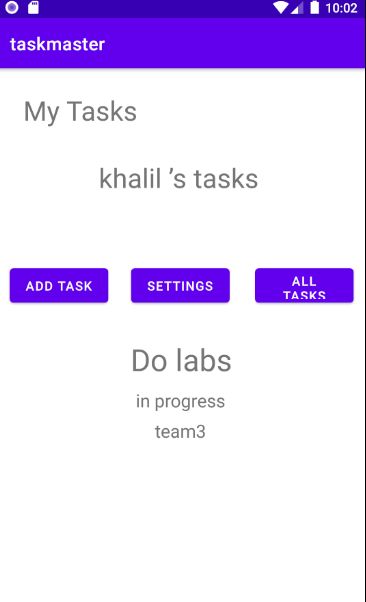
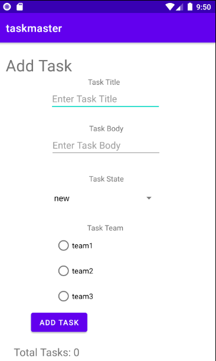
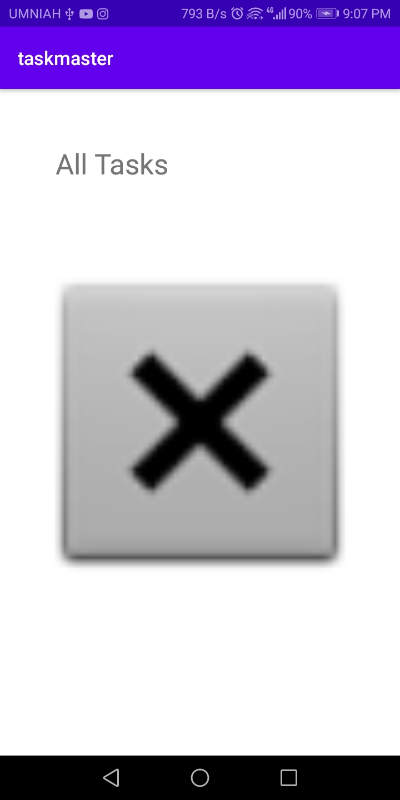
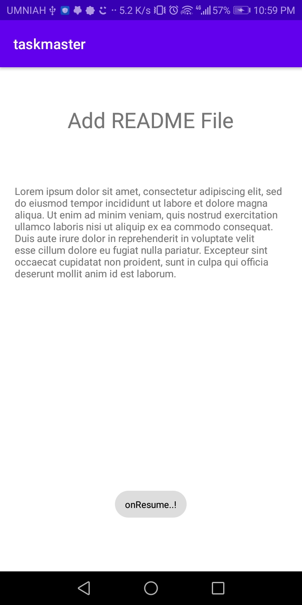
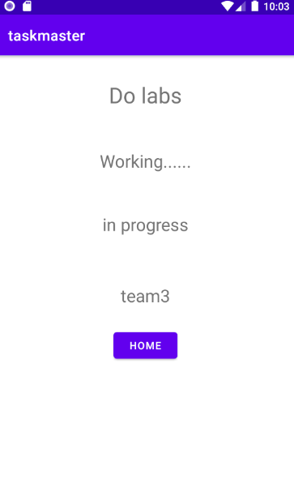
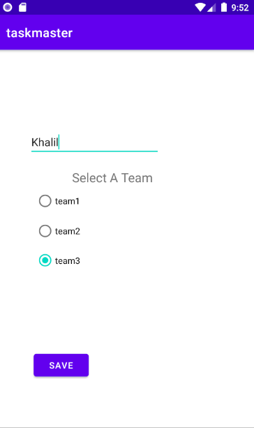
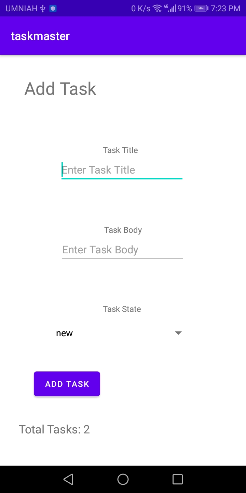

# taskmaster

An Android app that allow the users to manage their tasks.

**Lab26:**

* Create Home Page
* Create Add Task Page
* Create All Tasks Page

**Lab27:**

* Edit Home Page
* Create Task Detail Page
* Create Settings Page

**Lab28:**

* Update Home Page by added RecyclerView.
* Update Task Detail Page

**Lab29:**

* Update Add Task Page so the tasks will be saved in the local database and active total tasks feature.
* Update Home by make the RecyclerView retrieve all the tasks from thedatabase.
* Update Task Detail Page

**Lab31:**

* Add Espresso tests

**Lab32:**

* Modify the Add Task pahe to save the data entered in to DynamoDB.
* Refactor the homepage’s RecyclerView to display all Task entities in DynamoDB.

**Lab33:**

* Update Task model and Create Team model and added three hardcoded teams to DynamoDB.
* Modify Add Task form to include Radio Buttons for teams.
* Allow the user to choose their team on the Settings page.
* Modify RecyclerView and Task Details Page to contain team info.

## Home Page

## Add Task Page

## All Tasks Page

## Task Detail Page

## Updated Task Detail Page v3

## Settings Page

## Updated Task Page

